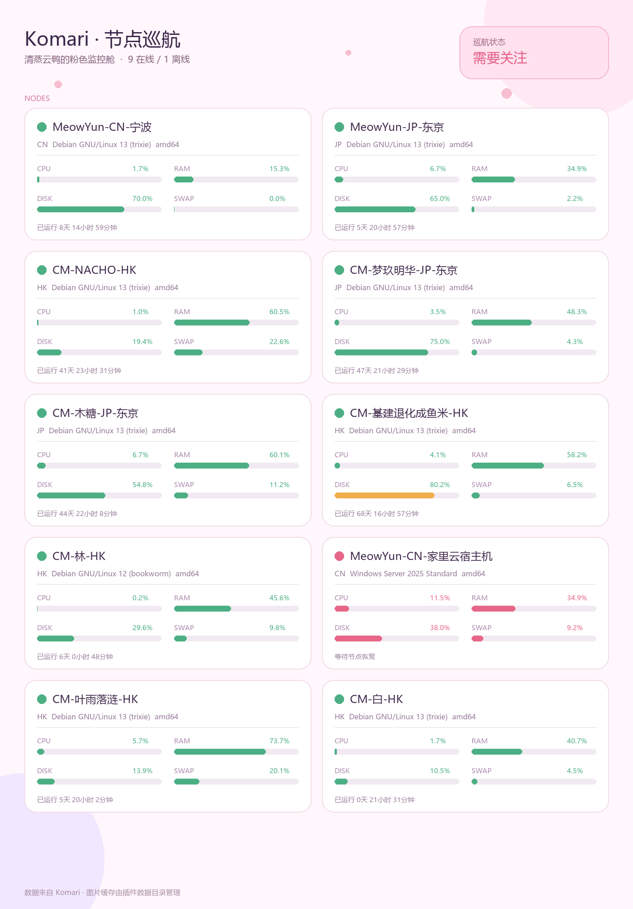

# Komari 监控

Komari 监控是一款面向 AstrBot 的节点状态插件。它会从 Komari 站点读取节点运行数据，并生成清晰的粉色监控卡片；当节点离线或恢复在线时，还可以自动向指定会话发送提醒。



## 功能

- 以图片展示节点在线状态、CPU、内存、磁盘、Swap 和运行时长。
- 支持 Komari 公开接口，也支持通过 Token 访问需要鉴权的站点。
- 后台定时检查节点状态，离线和恢复在线分别提醒一次，避免重复通知。
- 支持多个提醒会话，可按 AstrBot 的 UMO（统一消息来源）填写。
- 兼容 Windows、Linux 和 macOS，并针对不同系统提供中文字体候选。
- 监控图片与状态记录保存在 AstrBot 的插件数据目录中，不写入插件代码目录。

## 配置

在 AstrBot 插件配置中填写以下项目：

| 配置项 | 说明 |
| --- | --- |
| `base_url` | Komari 站点地址，例如 `https://monitor.example.com`。不要填写末尾斜杠。 |
| `api_token` | 可选。站点需要鉴权时填写 Komari Token；留空则使用公开接口。 |
| `notification_enabled` | 是否启用节点上下线提醒。 |
| `notification_targets` | 接收提醒的 UMO 会话列表，每行一个。 |
| `poll_interval` | 后台检查间隔，单位为秒，最小值为 30。 |
| `cache_ttl` | 状态数据的短时缓存时间，单位为秒。 |

配置保存后重载插件即可生效。

## 使用

插件仅提供一个指令：

```text
/komari
```

发送后会返回当前 Komari 节点状态图片。如果站点暂时不可用，插件会返回简明的错误提示，不会影响 AstrBot 其他功能。

## 上下线提醒

插件第一次成功检查时只建立当前状态，不会发送提醒。后续检查发现节点从在线变为离线时发送一次“节点离线”提醒；节点恢复在线后再发送一次“节点恢复在线”提醒。相同状态持续期间不会重复发送。状态记录会持久化保存，插件重载后仍然保持去重效果。

## 许可证

本项目采用 GNU Affero General Public License version 3（AGPL-3.0）。
